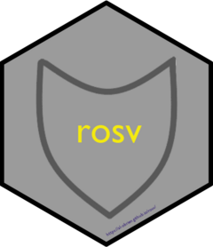

<!-- README.md is generated from README.Rmd. Please edit that file -->

# rosv <a href="https://al-obrien.github.io/rosv/"></a>

<!-- badges: start -->

[](https://CRAN.R-project.org/package=rosv)
[](https://cran.r-project.org/web/checks/check_results_rosv.html)
[](https://github.com/al-obrien/rosv/actions/workflows/R-CMD-check.yaml)
[](https://app.codecov.io/gh/al-obrien/rosv?branch=master)
[](https://cran.r-project.org/package=rosv)
[](https://cran.r-project.org/package=rosv)
<!-- badges: end -->

## Overview

The {rosv} package is an API client to the [Open Source Vulnerability
(OSV) database](https://osv.dev/). Both high and low level functions are
available to query the database for vulnerabilities in package
repositories across various open source ecosystems such as CRAN,
Bioconductor, PyPI, and many more. Queries made against the OSV database
are useful to check for package vulnerabilities (including by specific
versions) enumerated in package management files such as
`requirements.txt` (Python) and `renv.lock` (R). Checking valid query
construction, API response pagination, and parsing content are all
handled by {rosv}.

Various helper functions assist in the administration of [Posit Package
Manager](https://packagemanager.posit.co/client/#/) or similar services.
Packages can be routinely examined for new vulnerabilities which aide in
the creation and updating of curated repositories as well as assigning
block lists.

More details about the OSV project and associated API can be found here:
<https://google.github.io/osv.dev/>.

## Installation

``` r
install.packages('rosv')
library(rosv)
```

For the latest development version, you can install {rosv} from GitHub:

``` r
remotes::install_github('al-obrien/rosv')
```

## Basic usage

The fastest and simplest way to get started with {rosv} is to use the
`osv_query()` function.

1.  Provide a package name and related ecosystem to fetch any identified
    vulnerabilities.

    ``` r
    osv_query('dask', ecosystem = 'PyPI')
    ```

2.  Query multiple packages at the same time and across ecosystems.

    ``` r
    osv_query(c('dask', 'readxl', 'dplyr'),
              ecosystem = c('PyPI', 'CRAN', 'CRAN'))
    ```

3.  Return results only for packages provided and not others that may be
    part of the same vulnerability.

    ``` r
    osv_query('apache-airflow', ecosystem = 'PyPI', all_affected = FALSE)
    ```

4.  Download all vulnerabilities listed for an ecosystem.

    ``` r
    osv_query(ecosystem = 'CRAN', all_affected = FALSE)
    ```

## Development notes

{rosv} leverages {httr2} and {httptest2} for its core API client
functionality and uses R6 classes for its low-level interface to the OSV
API. There are also plans to have more types of returned details and
parsing of content.
